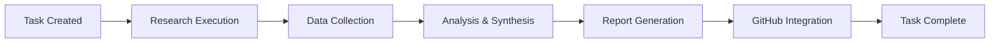
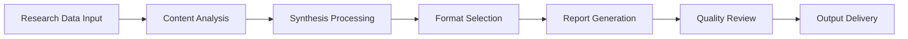
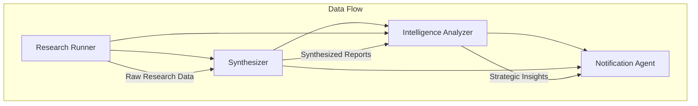
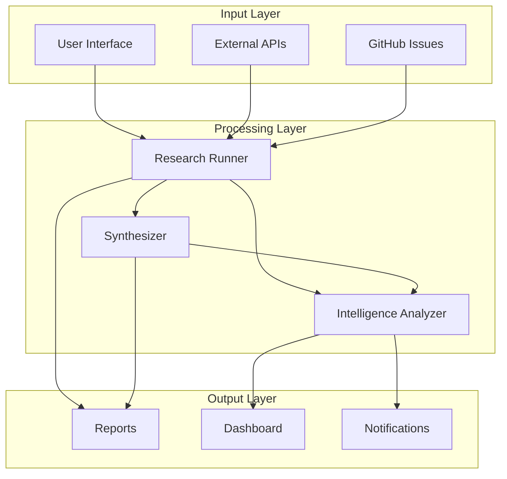

# AGENTS OVERVIEW

Note: Agent 1 currently includes both flat (compat) and nested fields while CI migrates.
Note: Agent 2 currently includes both flat (compat) and nested fields while CI migrates.

## Career Intelligence Space Agent System

This document provides a comprehensive overview of all agents in the Career Intelligence Space platform, their capabilities, interactions, and deployment strategies.

### Agent Architecture

#### Core Principles

- **Modular Design**: Each agent serves a specific purpose
- **Event-Driven**: Agents respond to triggers and events
- **Scalable**: Horizontal and vertical scaling capabilities
- **Resilient**: Built-in error handling and recovery
- **Observable**: Comprehensive logging and monitoring

#### Agent Framework

```yaml
agent:
  name: string
  version: semver
  type: [research|analysis|synthesis|automation|notification]
  triggers: [manual|scheduled|event-based]
  dependencies: [list of required services]
  outputs: [logs|reports|data|actions]
```

### Current Agent Roster

| Agent | Purpose | Strengths | Status |
|-------|---------|-----------|--------|
| Research Runner (1) | Data collection and research task execution | Multi-source aggregation, automated citations | Active |
| Synthesizer (2) | Content synthesis and report generation | Executive summaries, technical documentation | Active |
| Intelligence Analyzer (3) | Strategic analysis and insights | Pattern recognition, predictive modeling | Planned |

#### 1. Research Runner Agent

**Status**: Active | **ID**: `research` | **Version**: 1.0.0

**Purpose**: Automated research task execution and data collection

**Capabilities**:
- Multi-source research aggregation
- Intelligent content summarization
- Automated citation management
- Progress tracking and reporting
- Integration with GitHub Issues

**Configuration**: `agents/research.yml`
**Template**: `tasks/templates/TEMPLATE_research_task.yml`
**Logs**: `99_LOGS/agents/research_runner_log.md`

**Typical Workflow**:


#### 2. Synthesizer Agent

**Status**: Active | **ID**: `synth` | **Version**: 1.0.0

**Purpose**: Automated content synthesis and executive report generation

**Capabilities**:
- Multi-format content synthesis (executive, technical, narrative)
- Cross-source data integration
- Automated citation and reference management
- Template-based report generation
- Presentation slide creation

**Strengths**:
- Executive summary generation
- Technical documentation synthesis
- Multi-source content integration
- Format-flexible output generation
- Citation management and validation

**Configuration**: `agents/synth.yml`
**Template**: `tasks/templates/TEMPLATE_synthesis_task.yml`
**Logs**: `99_LOGS/agents/synthesizer_log.md`

**Typical Workflow**:


### Agent Handoff Map



### RACI Matrix

| Activity | Research Runner | Synthesizer | Intelligence Analyzer | User |
|----------|-----------------|-------------|----------------------|------|
| Data Collection | R | I | I | C |
| Content Synthesis | C | R | I | A |
| Report Generation | I | R | C | A |
| Strategic Analysis | I | C | R | A |
| Quality Review | C | C | C | R |
| Final Approval | I | I | I | R |

**Legend**: R=Responsible, A=Accountable, C=Consulted, I=Informed

### Planned Agents (Roadmap)

#### 3. Intelligence Analyzer Agent

**Status**: Planned | **ID**: `intelligence` | **Priority**: High

**Purpose**: Strategic analysis and predictive insights generation

**Planned Capabilities**:
- Pattern recognition across research data
- Trend analysis and forecasting
- Strategic recommendation generation
- Cross-domain insight synthesis
- Predictive modeling

#### 4. Career Analysis Agent

**Status**: Planned | **ID**: `career-analyzer` | **Priority**: Medium

**Purpose**: Automated career path analysis and recommendation generation

**Planned Capabilities**:
- Resume analysis and optimization
- Job market trend analysis
- Skills gap identification
- Career progression modeling
- Salary benchmarking

#### 5. Network Intelligence Agent

**Status**: Planned | **ID**: `network-intel` | **Priority**: Medium

**Purpose**: Professional network analysis and relationship mapping

**Planned Capabilities**:
- LinkedIn profile analysis
- Industry connection mapping
- Networking opportunity identification
- Relationship strength scoring
- Introduction pathway optimization

#### 6. Interview Preparation Agent

**Status**: Planned | **ID**: `interview-prep` | **Priority**: Low

**Purpose**: Automated interview preparation and practice facilitation

**Planned Capabilities**:
- Company-specific question generation
- Mock interview simulation
- Answer quality assessment
- Behavioral question coaching
- Technical skill evaluation

#### 7. Market Intelligence Agent

**Status**: Planned | **ID**: `market-intel` | **Priority**: Low

**Purpose**: Real-time job market monitoring and analysis

**Planned Capabilities**:
- Job posting aggregation
- Salary trend monitoring
- Skill demand tracking
- Company culture analysis
- Remote work opportunity scanning

### Agent Interactions

#### Data Flow



#### Event System

- **Task Creation**: Triggers research workflows
- **Data Updates**: Cascades to dependent agents
- **Threshold Alerts**: Notifies users of significant changes
- **Integration Events**: GitHub issues, calendar updates

### Agent Management

#### Deployment Strategy

```bash
# Agent lifecycle management
deploy-agent --config agents/research.yml --environment production
scale-agent --name research --instances 3
upgrade-agent --name research --version 1.1.0
monitor-agent --name research --metrics all
```

#### Configuration Management

- **Environment Variables**: Runtime configuration
- **YAML Configs**: Agent-specific settings
- **Template System**: Task standardization
- **Version Control**: Configuration versioning

#### Health Monitoring

```yaml
health_check:
  endpoint: /health
  interval: 30s
  timeout: 5s
  retries: 3
  metrics:
    - cpu_usage
    - memory_usage
    - task_queue_depth
    - response_time
    - error_rate
```

### Security & Compliance

#### Access Control

- **API Authentication**: Token-based access
- **Role-Based Permissions**: Granular access control
- **Data Encryption**: At-rest and in-transit
- **Audit Logging**: Complete activity trails

#### Privacy Protection

- **Data Anonymization**: PII protection
- **Retention Policies**: Automated data cleanup
- **Consent Management**: User preference tracking
- **GDPR Compliance**: Right to be forgotten

### Performance & Scaling

#### Resource Management

```yaml
resource_limits:
  cpu: 2 cores
  memory: 4GB
  storage: 10GB
  network: 100Mbps
  concurrent_tasks: 5
```

#### Scaling Policies

- **Horizontal Scaling**: Multiple agent instances
- **Vertical Scaling**: Resource allocation adjustment
- **Auto-scaling**: Load-based instance management
- **Load Balancing**: Request distribution

### Integration Points

#### GitHub Integration

- **Issue Creation**: Automated task tracking
- **PR Updates**: Research findings integration
- **Workflow Triggers**: CI/CD pipeline integration
- **Release Management**: Version deployment

#### External APIs

- **LinkedIn API**: Professional data access
- **Job Board APIs**: Market intelligence
- **Calendar APIs**: Interview scheduling
- **Communication APIs**: Notification delivery

### Development Guidelines

#### Agent Creation Checklist

- [ ] Configuration file in agents/
- [ ] Task template in tasks/templates/
- [ ] Documentation in docs/
- [ ] Log structure in 99_LOGS/agents/
- [ ] GitHub workflow integration
- [ ] Health check endpoints
- [ ] Error handling implementation
- [ ] Security review completion

#### Testing Strategy

- **Unit Tests**: Individual component testing
- **Integration Tests**: Inter-agent communication
- **Load Tests**: Performance validation
- **Security Tests**: Vulnerability assessment
- **User Acceptance Tests**: End-to-end validation

### Troubleshooting

#### Common Issues

1. **Agent Timeout**: Check resource allocation
2. **Memory Leaks**: Monitor memory usage patterns
3. **API Rate Limits**: Implement backoff strategies
4. **Configuration Errors**: Validate YAML syntax
5. **Network Issues**: Check connectivity and firewall

#### Debug Commands

```bash
# Agent debugging
agent-debug --name research --level verbose
agent-logs --name research --tail 100
agent-metrics --name research --time-range 1h
agent-trace --name research --request-id abc123
```

### Future Enhancements

#### Planned Features

- **Machine Learning Integration**: Predictive analytics
- **Natural Language Interface**: Voice and chat commands
- **Mobile App Integration**: Cross-platform access
- **Advanced Analytics**: Behavioral insights
- **Collaboration Tools**: Team-based workflows

#### Research Areas

- **Edge Computing**: Distributed processing
- **Blockchain Integration**: Credential verification
- **AR/VR Interfaces**: Immersive experiences
- **Quantum Computing**: Advanced optimization

# UPGRADE:
